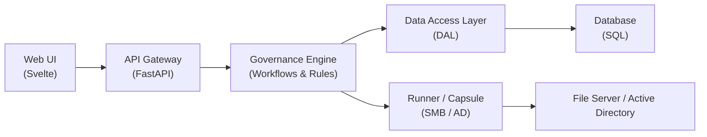

# BornToShare — Alpha

⚠️ **Status: ALPHA**

BornToShare is an open-source platform for **data access governance**,  
designed to manage **who can access what, why, and for how long** on
enterprise storage systems.

This repository contains the **Community Edition (CE)** core.  
APIs, data models, and internal contracts are **subject to change**.

---

## 🎯 Vision

In many organizations, access to shared data is:
- granted permanently
- approved informally
- hard to audit
- poorly documented

BornToShare aims to change this by introducing:
- explicit access requests
- owner-based approval workflows
- time-bound permissions
- automated enforcement through runners

The goal is to make data access **visible, controlled, and auditable**.

---

## 🧩 What’s in this repository (Community Edition)

The Community Edition provides a fully usable core:

- API Gateway (FastAPI)
- Governance engine (business rules & workflows)
- Data Access Layer (DAL)
- Web UI (Svelte)
- SMB runner (Active Directory / NTFS)
- Request → approval → ACL application workflow
- Local / basic authentication

Everything in this repository can be **used, tested, and deployed**
without any enterprise-only feature.

---

## 🏗️ Architecture (Mermaid)

Design principles:
- Only runners interact with target infrastructures (SMB, AD, etc.)
- Gateway and Governance are network-agnostic
- Network access, DNS, and routing are managed outside the application

---

## 🔐 Editions & Authentication

### Community Edition (this repository)
- Local authentication
- Core identity model
- Standard governance workflows
- Open REST APIs

### Enterprise Edition (not open-sourced)
- External IdP integration (e.g. Keycloak)
- Advanced audit & compliance features
- Smart policies engine
- Automation & scheduled enforcement
- Multi-tenant and enterprise capabilities

The Community Edition remains **fully usable in production**.

---

## 🚀 Project status

- APIs are evolving
- Database schema may change
- UX is under active development
- Feedback and contributions are welcome

This project is currently in **alpha stage**.

---

## 🤝 Contributing

Contributions are welcome from:
- FastAPI / backend developers
- Svelte / frontend developers
- DevOps & container specialists
- Security and governance enthusiasts

How to start:
1. Check issues labeled **`good first issue`**
2. Read `CONTRIBUTING.md`
3. Open an issue or discussion if you have questions

This project values **clear communication and collaboration**.

---

## 📄 License

This project is licensed under the **Apache License 2.0**.

You are free to use, modify, and distribute the Community Edition
according to the terms of the license.

---

## ⚠️ Disclaimer

BornToShare is provided **as-is**, without warranty of any kind.
Use in production is at your own discretion.